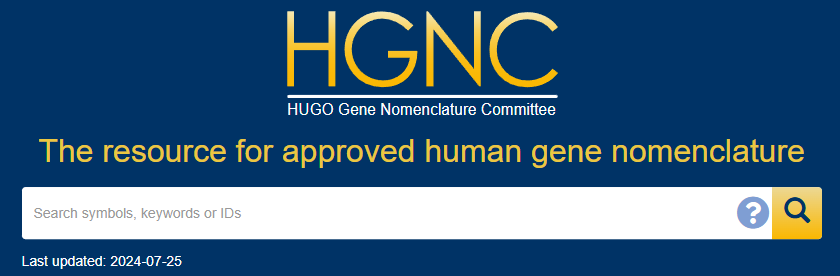

# R2easygene is a package intended to provide an easy and quick way to update gene names of a seurat object.

#### It provides a fast and simple way to update gene names to the latest approved symbols, ensuring consistency across samples, especially in projects that compile data from multiple experiments. It addresses discrepancies in gene naming conventions that may cause batch effects when raw data is not available for realignment.

#### The motivation for this package came from a finding in my own work in which I found that gene aliases were introducing significant batch effect, even after integration methods were implemented. I discovered that these alternate and outdated, as well as sample-specific gene names, were a small but significant source of noise in the data. I hope that this provides an easy and relatively quick way of removing this source of variation.

## Installation
#### Install Via GitHub

```r
devtools::install_github("ryanreis333/R2easygene")
```



#### The package relies on the HGNChelper package from the HUGO Gene Nomenclature Committee, above.

#### If there is any issues with loading this package alongside R2easygene, you can downlaod this separately by running the following:
```r
install.packages("HGNChelper")
```

## Bug Reports/New Features

#### If you run into any issues or bugs please submit a [GitHub issue](https://github.com/ryanreis333/R2easygene/issues) with details of the issue.

- If possible please include a [reproducible example](https://reprex.tidyverse.org/). 

#### [Pull Requests](https://github.com/ryanreis333/R2easygene/pulls) are welcome for bug fixes, new features, or enhancements.
